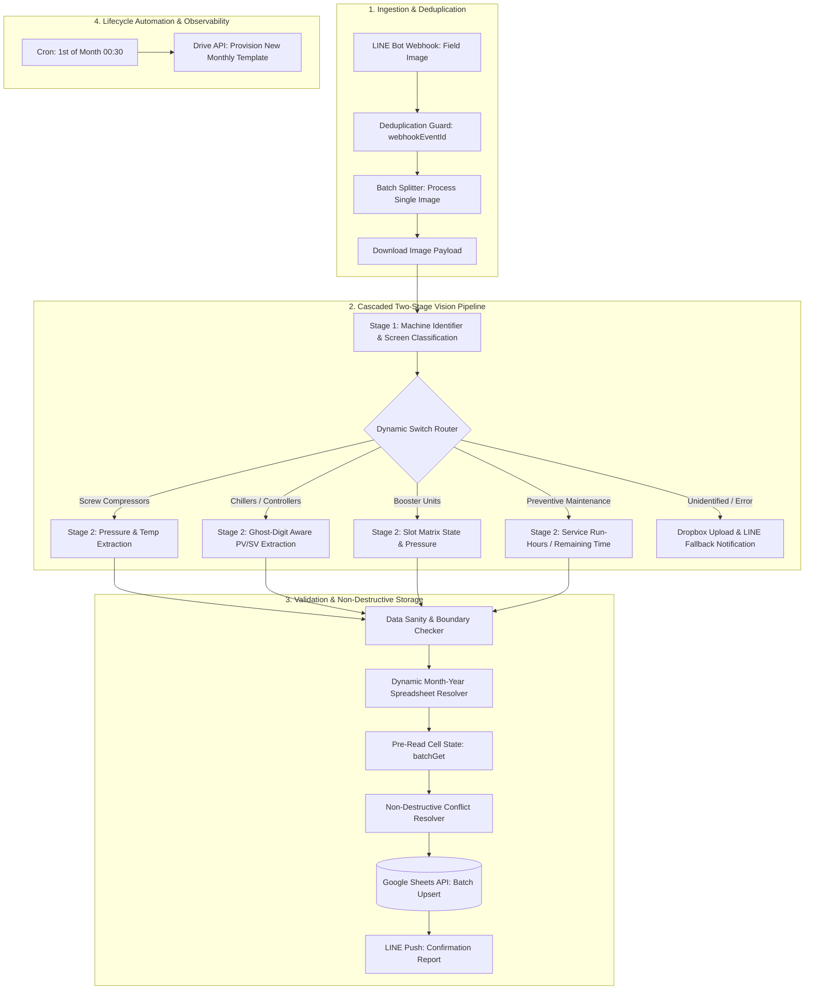

# Machine Inspection with Vision Models & Google Sheets

[](https://n8n.io/)
[-4285F4?style=flat-square&logo=googlecloud)](https://cloud.google.com/vertex-ai)
[](https://developers.line.biz/)
[](https://developers.google.com/sheets/api)

Two n8n workflows turn LINE photos of machine displays into validated inspection records and create monthly inspection spreadsheets.

---

## 📌 Architectural Overview

The end-to-end data pipeline is structured into four resilient, fault-tolerant execution stages:



---

## ⚙️ Core Technical Highlights

### 1. Cascaded Two-Stage Vision Pipeline (VLM Routing)
* **Stage 1 (Classification & Tag Extraction):** The incoming image is processed by an initial Vision-Language Model call to extract the machine identifier label (`machine_label`) and classify the screen display type (`PRODUCTION_MONITOR`, `PROFACE_HMI`, `KAESER_SERVICE`, `OTHER`).
* **Stage 2 (Domain-Specific Extraction):** The workflow dynamically routes the image to specialized system prompts tuned specifically for the identified equipment type. This cascaded architecture separates extraction instructions by equipment type.

### 2. Ghost-Digit Detection on 7-Segment Displays
* Industrial LCDs and seven-segment displays frequently exhibit unlit segments that reflect ambient light, causing standard OCR models to misread unlit digits (e.g., reading a dim background outline as an active "8").
* A custom validation algorithm cross-references verbatim textual output (`pv_raw`) against brightly lit segment counts (`pv_digits`), rejecting ambiguous reads before database writes:
$$\text{Lit Segment Count}(pv\_digits) \neq \text{Extracted Digit Length}(pv\_raw) \implies \text{Flag Blocker}$$

### 3. Non-Destructive Cell Upsert & Conflict Prevention
* **Anti-Overwrite Protection:** Inspection sheets require both operational checkmarks (`/`) and discrete telemetry values (temperature, pressure, run hours).
* The workflow executes a `batchGet` request to inspect target cell ranges prior to writing. If a cell contains pre-existing numerical telemetry, generic checklist marks (`/`) are blocked from overwriting it. Valid telemetry updates are allowed to update placeholder or empty values.

### 4. Enterprise Resilience & State Guards
* **Webhook Storm Protection:** Implements an in-memory execution store (`global.doneKeys`, max 500 entries) and validates `webhookEventId` to prevent duplicate writes during network retries or batch photo uploads.
* **Autonomous Monthly Lifecycle Provisioning:** At `00:30` on the 1st of every month, a scheduled workflow provisions a new monthly inspection workbook from a master template, computes dynamic month-end dates, and updates cell metadata across 18 distinct machine sheets via Google Drive & Sheets API.
* **Inspection feedback:** LINE messages report inspection results, and Dropbox supports fallback image storage. A separate n8n Error Trigger workflow for unhandled failures is not included in these exports.

---

## 📂 Repository Layout

```text
smart-factory-inspection-vision/
├── README.md
└── workflows/
    ├── machine-inspection-pipeline.json
    └── monthly-template-provisioner.json
```

| Workflow File | Trigger Type | Primary Responsibilities |
| :--- | :--- | :--- |
| `machine-inspection-pipeline.json` | Webhook (LINE Messaging API) | Receives machine display photos, executes two-stage VLM extraction, validates numerical ranges, resolves cell conflicts, and upserts data into Google Sheets. |
| `monthly-template-provisioner.json` | Schedule (Monthly Cron: 00:30) | Copies master checklist templates, calculates month-end boundaries, and updates target metadata across all machine tabs. |

---

## 🚀 Setup & Deployment

### Prerequisites
1. **n8n Instance** (with node versions compatible with the exported workflows)
2. **Google Cloud Service Account** with Google Drive & Google Sheets API enabled
3. **Google Vertex AI API** access (Gemini Multimodal Models)
4. **LINE Messaging API Channel** (Channel Access Token & Webhook configured)
5. **Dropbox API App** (OAuth2 token for storing error capture images)

### Installation
1. Clone the repository:
   ```bash
   git clone https://github.com/Panutle/smart-factory-inspection-vision.git
   cd smart-factory-inspection-vision
   ```
2. In the n8n web console:
   * Navigate to **Workflows** > **Import from File**.
   * Import `workflows/machine-inspection-pipeline.json` and `workflows/monthly-template-provisioner.json`.
3. Configure credentials:
   * **Google Drive / Sheets**: Rebind OAuth2 and service-account references to your own credentials, including those used by HTTP Request nodes.
   * **Google Vertex AI**: Set up Vertex credentials with project ID and region.
   * **LINE Webhook / Push**: Configure Channel Access Tokens in HTTP Request nodes.
   * **Dropbox OAuth2**: Bind to image link nodes.
4. Validate one sample inspection against a test spreadsheet before activating scheduled or webhook execution.


## Reproduction notes

This repository contains workflow exports. The source spreadsheets, operational datasets, credentials, and connected services must be supplied separately.

1. Import the JSON files with the workflows inactive and resolve any unavailable node types.
2. Rebind credential references to accounts in your own n8n instance.
3. Replace document IDs, sheet names, folder IDs, webhook endpoints, LINE recipient IDs, and embedded configuration in both Code and HTTP Request nodes. Credential binding alone is not enough.
4. Match sheet headers and data types to the field names read by the workflow; there is no automatic source-schema provisioning.
5. Run a representative input against test destinations and inspect the extracted records or generated plan. Verify the workflow timezone and alert recipients before enabling schedules.

Configure both the Google service-account and Google Drive OAuth2 references used by the exports, plus Vertex AI, Dropbox, and LINE. Check the HTTP Request nodes as well as credential selectors. The referenced model must be available in your Vertex AI project and region.

The exports demonstrate implementation choices; this repository does not include a reproducible benchmark for accuracy, time savings, or production availability.

The pre-read and write requests are separate operations, so the cell-conflict checks do not provide transaction isolation against concurrent writers.
